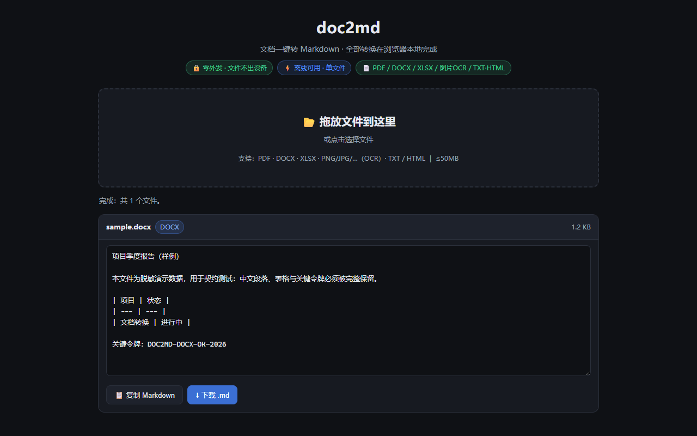

# doc2md — 文档一键转 Markdown（本地 · 离线 · 零外发）

<p align="center">
  <a href="LICENSE"></a>
  <a href="https://github.com/sakuraqqq/doc2md"></a>
  <a href="https://sakuraqqq.github.io/doc2md/"></a>
  <a href="https://sakuraqqq.github.io/doc2md/manifest.json"></a>
</p>

> 参考 Microsoft MarkItDown 的「文档 → Markdown」思路，做一个**纯前端网页版**：单目录离线（`index.html` + `vendor/` + `langs/`，双击即用）、断网可用（PWA 缓存全功能）、可装到手机主屏，全部转换在你的浏览器本地完成。
> 仓库：<https://github.com/sakuraqqq/doc2md>（v1 阶段）。

## 一句话

把 **PDF / DOCX / XLSX / 图片(OCR) / TXT·HTML** 五种文件拖进网页，直接在本地转成干净的 Markdown——**文件不上传任何服务器，断网也能用，手机可「添加到主屏幕」当 App 用**。

## 界面预览



> **GIF 演示（待补充）**：`assets/demo.gif` —— 计划录制「拖放 → 转换 → 复制/下载 .md」与手机端「添加到主屏幕 → 离线打开」两种场景，发布前补充（本 README 先留占位）。

## 为什么做

- 市面上的转换工具大多要上传文件、注册账号或装 Python 环境；MarkItDown 是 CLI/服务端思路，网页版体验友好但基本都走云端。
- 大多数「文档转 Markdown」网页版要么在服务器转（有隐私风险），要么依赖 CDN（断网即废）。
- 本项目把这两条路都堵上：**零外发 + 单目录离线（index+`vendor/`+`langs/`，同源分文件）+ PWA 离线缓存**，`index.html`（32KB 应用逻辑）+ 本地库文件就是一个完整的工具。

## 功能一览（v1）

| 输入 | 转换器 | 状态 v1 | 说明 |
|---|---|---|---|
| TXT / HTML | 内置文本 / HTML→MD | ✅ | 自动识别 BOM / UTF-8 / UTF-16 |
| DOCX | mammoth → HTML → Markdown | ✅ | 标题/列表/**GFM 表格**/加粗等（T-5 拍板：保留表格） |
| PDF | pdf.js + tesseract.js OCR | ✅ | 文本层直取；扫描页/无文本层自动 OCR 降级（eng+chi_sim） |
| XLSX | read-excel-file | ✅ | 多 sheet → GFM 表格，日期/数字格式化 |
| 图片（PNG/JPG/…） | tesseract.js OCR | ✅ | eng+chi_sim（LSTM 量化，语言包 `langs/` 同源懒加载） |
| PWA | manifest + service worker | ✅ | 添加到主屏（standalone）+ 离线缓存（SW precache + 离线回退） |

全部库（mammoth / pdf.js / tesseract.js / read-excel-file）与 OCR 语言包为**同源分文件**（`vendor/` + `langs/`，`index.html` 仅 32KB 应用逻辑）；worker/WASM 本地 blob——无任何 CDN 引用。

## 为什么这么定（口径）

- **零外发是红线**：v1 所有转换在本地浏览器完成，不上传任何文件/数据；worker 的 `fetch`/`importScripts` 被拦截到本地 blob（决策史 DD-4），语言包 `langs/` 同源懒加载（DD-14）；任何网络能力需在 README + 审查清单显式声明后才可加。
- **不信任扩展名**：按 magic bytes 嗅探（docx=zip+word/、pdf=%PDF、xlsx=zip+xl/…），扩展名只作辅助。
- **范围控制**：v1 只做 5 类格式；音频转录、EPUB、PPTX 等 v2 再议。
- **PWA 先行，Capacitor 后置**：手机体验先走零打包成本的 PWA（已验证离线）；原生套壳（Capacitor）只做了可行性记录（见 `docs/architecture.md` §8.4），是否做待 PWA 上线后按反馈拍板。
- **可追溯**：每版本的契约测试、决策史、发布记录、大小 + SHA256 全留存（见 docs/）。

## 怎么用

**桌面**：打开 <https://sakuraqqq.github.io/doc2md/>（发布后生效；发布前双击 `index.html` 即可）→ 拖入文件或点「选择文件」→ 预览 Markdown → **复制** 或 **下载 .md**。可选多文件（逐个转换）。

**手机（PWA）**：浏览器打开页面 → 菜单「添加到主屏幕」→ 以独立窗口启动（standalone）；首次在线打开后，后续**离线也能打开并使用**（Service Worker 缓存了应用本体；转换本身全程本地，断网不影响）。

> 手机适配：拖放区 ≥300px 大触控面、按钮/触控目标 ≥44px、字号 ≥12px、文字对比度达 WCAG AA（≥4.5:1）——见 `tests/pwa-audit.mjs`。

## 目录结构

```
doc2md/
├── index.html              # 应用逻辑（≈32KB：注册表/嗅探/UI/挂钩；库全部同源分文件引入）
├── manifest.json / sw.js   # PWA：安装清单 + 离线 Service Worker（v3：precache 全量 vendor/langs）
├── icons/                  # PWA 图标（192/180/512/512-maskable，tools/gen-icons.mjs 生成）
├── vendor/                 # 库同源分文件（mammoth/pdf.js/tesseract/core/read-excel-file；构建件+审查用）
├── langs/                  # OCR 语言包（eng/chi_sim，同源懒加载；SW 预缓存）
├── tools/
│   ├── embed-bline.mjs     # 单文件组装（历史：B线资源嵌入；DD-7——T9′ 拆分后仅存档）
│   ├── gen-icons.mjs       # PWA 图标生成（零依赖）
│   ├── gen-sample-image.ps1# 契约样例图片生成（Windows GDI+，固定资产）
│   └── verify-ocr.mjs      # 离线 OCR 实证（npm run verify:ocr）
├── tests/
│   ├── CONTRACT.md         # 契约即规格（断言清单/拍板点 T-1~T-5）
│   ├── contract_v1.test.mjs# 契约测试（C/M 组）
│   ├── pwa-audit.mjs       # PWA/手机适配静态验收（48 项）
│   ├── gen-samples.mjs     # 固定样例生成（字节锁于 data/manifest.json）
│   └── data/               # 脱敏样例（sample.* + real-* 真实样例）
├── docs/
│   ├── architecture.md     # 架构与转换器接口契约（§8 PWA 与手机适配）
│   ├── design-decisions.md # 决策史（DD-4~12：OCR blob 化/样例覆盖事故/单文件陷阱…）
│   ├── licenses.md         # 复用库许可核对表（逐库一手证据）
│   └── DEV-NOTES.md        # 工作流程日志
├── .github/workflows/deploy-pages.yml  # GitHub Pages 自动部署（照 cola 同款）
├── LICENSE                 # MIT
├── AGENTS.md               # 本项目协作纪律
└── doc2md-项目规划与指令.md # 立项规划文档
```

## 测试与质量

- **契约测试**（`tests/CONTRACT.md`，断言即规格）：固定样例 `tests/data/`，断言「关键内容存在 + 无 console error + 转换 <500ms + 桌面/手机 390×844 双视口」。当前：B 组（样例字节锁/格式特征）全绿；C 组（6 用例×双端，含 docx GFM 表格 C6）与 M 组（手机视口 UI 链路）在**宿主浏览器独立验收全通**（QA t12：6 类样例令牌全命中、零外发请求、docx 输出标准 GFM 表格）。运行：`npm test`（需可启动浏览器的环境；无浏览器时以 `npm run test:direct` 跑静态组）。
- **PWA 静态验收**：`node tests/pwa-audit.mjs` —— 48/48（manifest 字段、图标尺寸、SW 语法与策略、触控/字号规格、WCAG 对比度 11 组全部 ≥4.5:1）。
- **离线 OCR 实证**：`npm run verify:ocr` —— 语言包离线识别契约样例，置信度 93%。
- **决策史**（`docs/design-decisions.md`，真实案例）：OCR 引擎全 blob 化（DD-4）、tessdata 选型（DD-5）、契约样例被覆盖事故与字节锁（DD-3/T-3）、点阵字体 OCR 无解 → 真实字体拍板（DD-6/DD-8/DD-10）、单文件组装脚本陷阱（DD-7）……
- **独立验收**：换环境/换数据重跑（`real-*` 真实样例入库登记）；第三方（第二个模型/视觉模型）只报告不修改；发布前全量回归（见发布核对清单）。

## 许可与合规

- 本项目自身：**MIT**（`LICENSE`）。
- 复用库逐个核对（**全部宽松许可、可商用**，一手证据见 `docs/licenses.md`）：mammoth 1.12.2（BSD-2-Clause）· pdf.js 3.11.174（Apache-2.0）· tesseract.js 6.0.1（Apache-2.0）· tesseract.js-core 6.0.0（Apache-2.0）· tessdata eng/chi_sim 4.0.0_best_int（MIT，上游 Apache-2.0 数据）· read-excel-file 5.8.7（MIT）· markitdown（MIT，仅参考不打包）。
- **分发义务**：内联文件头部注释保留各库版权声明；Apache-2.0 库的分发物附许可证文本副本（licenses.md 执行清单，公共发布前复核一遍）。
- **红线承诺：v1 零外发** —— 本地转换，文件不出你的设备。

## 开源配置（Topics，发布时设置）

`doc2md` · `doc-to-markdown` · `pdf` · `docx` · `xlsx` · `ocr` · `offline` · `pwa` · `single-file` · `web-app`

## 发展规划

阶段 0 立项 ✅ → 阶段 1 网页版 MVP ✅ → 阶段 2 契约测试与质量 ✅ → **阶段 3 GitHub Pages 发布 ← 当前** → 阶段 4 手机 App（PWA ✅；Capacitor 待拍板）→ 阶段 5 开源曝光（README 终极版/博客，见 `doc2md-项目规划与指令.md`）。

---

**English summary**: **doc2md** converts **PDF / DOCX / XLSX / images (OCR) / TXT·HTML** to clean Markdown entirely **in your browser** — a single offline HTML file (all engines bundled inline, no CDN, no server), plus **PWA support** (add to home screen, service-worker offline cache, standalone window). **No file ever leaves your device.** v1 covers all five formats (mammoth for DOCX with GFM tables, pdf.js + tesseract.js for PDF/OCR, read-excel-file for XLSX). Quality gates: contract tests with byte-locked samples and dual viewports, a 48-item PWA/accessibility audit, and offline OCR verification (93% confidence). Licensed **MIT**; all bundled libraries are permissively licensed (see docs/licenses.md).
